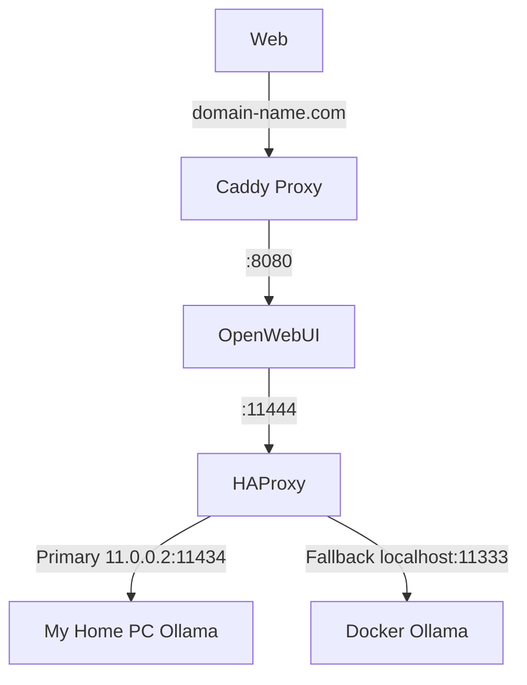

# Running OpenWebUI for OLLAMA and OpenAI with Caddy server! 

## Features:
- Caddy reverse proxy with HTTPS/SSL
- OpenWEBUI
- Load balance multiple ollama instances!
    - If one of your ollama servers is down, a backup will be used!
        - for example, if you shut down your home PC, but still want access to OpenWebUI


## Prereqs

- Access to docker and docker images (may need to login to docker and github)
- domain name (please remember to rename all instances in this repo)

- In my setup I am already running ollama ( `ollama serve` ) on a private network (11.0.0.0:11434).
- Inside the `haproxy.cfg` file, you can change the servers that tells haproxy to pick to connect to OLLAMA.
    - [!NOTE] If you want to run ollama on another machine like me, make sure it is bound to 0.0.0.0 not 127.0.0.1 !! `OLLAMA_HOST=0.0.0.0:11434`
    - Append the following to `/etc/systemd/system/ollama.service` file:
    - Environment="OLLAMA_HOST=0.0.0.0:11434"


## Run

Simply run: 
```sh
docker compose -f docker-compose.yml up -d
```

## How this works? 

Overview diagram:
```
Web → domain-name.com (Caddy)
    → OpenWebUI :8080
        → HAProxy :11444 (Load balance)
            → Primary: 11.0.0.2:11434 (My Home Ollama instance)
            → Fallback: :11333 (Docker Ollama running on this server)
```



______
## Testing 

### Docker run command

#### Creating a docker container for open web ui locally:
```sh
docker run -d  --network=host -e OLLAMA_BASE_URL=http://11.0.0.2:11434 -v open-webui:/app/backend/data --name open-webui --restart always ghcr.io/open-webui/open-webui:main
```

______
## TODOs:

- Logging: currently a little lackluster when debugging
